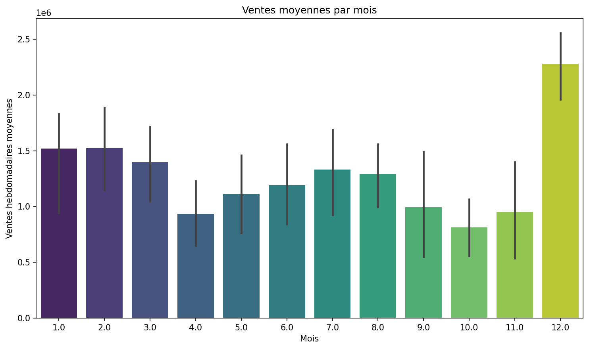
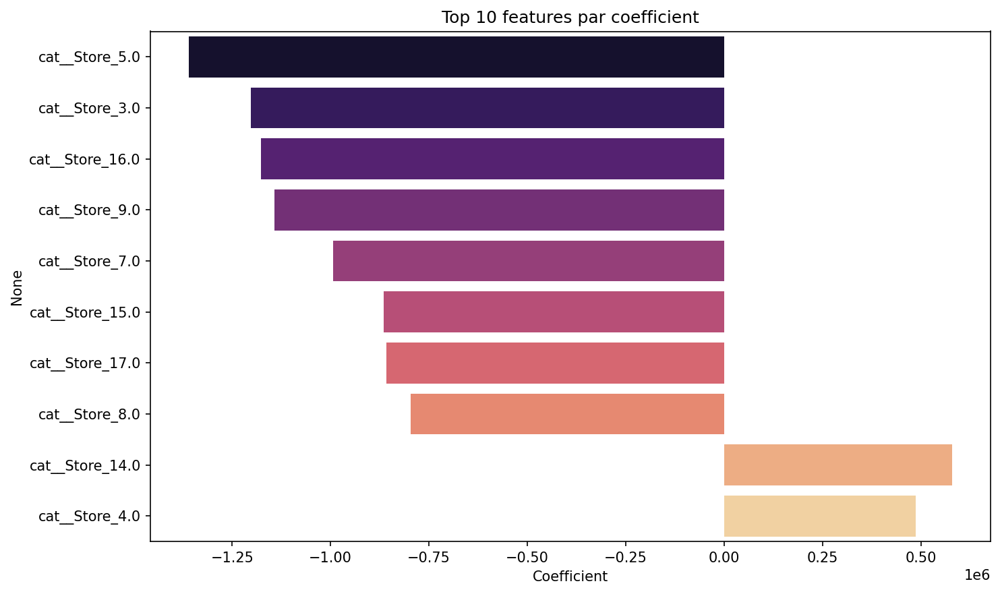
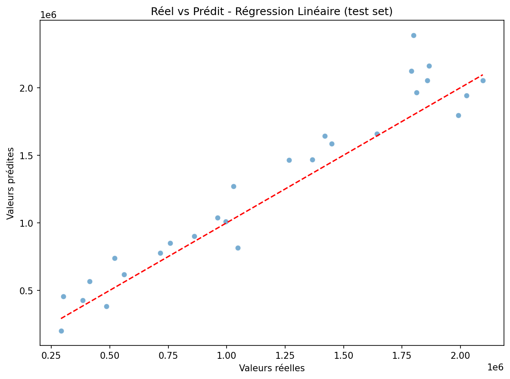
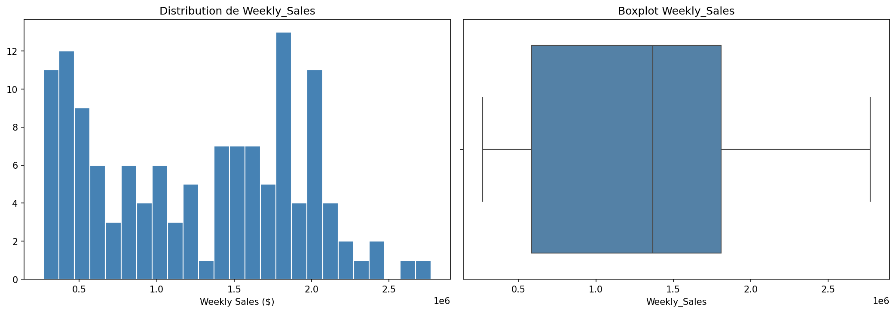
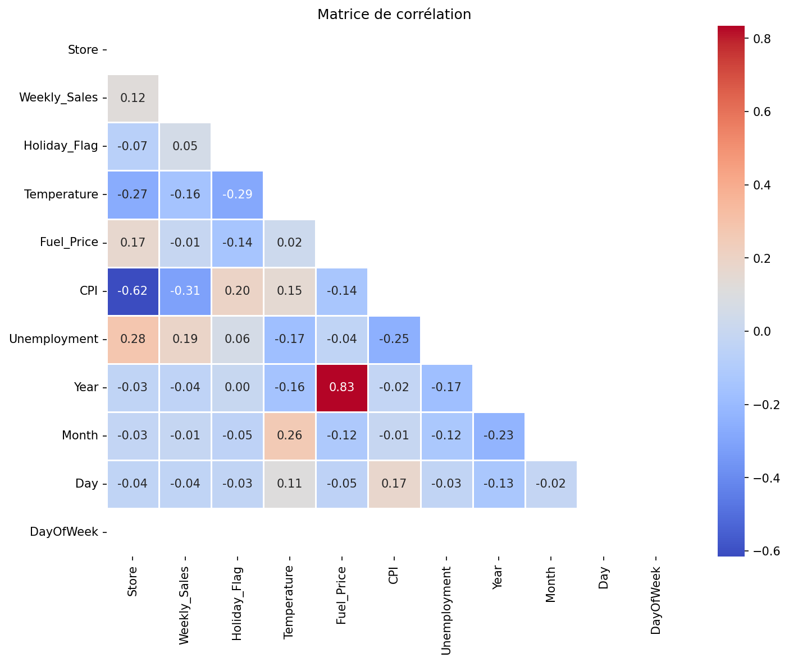

# 🛒 Walmart - Prediction des ventes hebdomadaires

[](https://www.python.org/)
[](https://jupyter.org/)
[](https://pandas.pydata.org/)
[](https://scikit-learn.org/)

## 📋 Contexte du Projet

Le service marketing de **Walmart** souhaite un modele de Machine Learning capable d'estimer les ventes hebdomadaires de ses magasins a partir d'indicateurs economiques (chomage, prix du carburant, CPI) et de donnees saisonnieres.

**Objectif** : predire `Weekly_Sales` avec la meilleure precision possible pour orienter les futures campagnes marketing.

**Dataset** : 150 lignes, 8 colonnes (donnees custom fournies par JEDHA, issues d'un challenge Kaggle modifie). Apres nettoyage (target manquante + outliers 3 sigmas) : **131 lignes exploitables**.

## 🎯 Resultats

### Comparaison des modeles

| Modele | R2 Train | R2 Test | MAE Test | RMSE Test |
|--------|----------|---------|----------|-----------|
| Regression Lineaire | 0.977 | 0.891 | $153,208 | $194,682 |
| Ridge optimise (alpha=0.01) | 0.977 | 0.892 | $151,995 | $193,651 |
| **Lasso optimise (alpha=500)** | **0.977** | **0.897** | **$151,358** | **$188,738** |

**Constats** :
- Le modele explique **~90% de la variance** des ventes sur le jeu de test
- L'ecart train/test (0.977 vs 0.891) indique un **leger overfitting**, corrige partiellement par la regularisation
- Le best alpha Ridge tres faible (0.01) confirme que le modele lineaire n'etait pas tres overfit
- **Lasso (alpha=500)** donne le meilleur R2 test (0.897) et elimine 1 feature sur 27

### Saisonnalite des ventes



### Feature Importance (coefficients du modele lineaire)



Le **Store** (identite du magasin) est de loin le facteur le plus predictif — il capture implicitement la taille et la localisation. Les indicateurs economiques (CPI, Unemployment) ont un impact limite en lineaire.

### Real vs Predicted



## 🏗️ Pipeline Technique

### 1. EDA et Nettoyage

- **Target manquante** : 14 lignes supprimees (pas d'imputation sur la target pour eviter le biais)
- **Feature engineering dates** : extraction de Year, Month, Day, DayOfWeek depuis la colonne `Date`
- **Outliers** : regle des 3 sigmas sur Temperature, Fuel_Price, CPI, Unemployment → 5 lignes supprimees
- **Dataset final** : 131 lignes, 10 features





### 2. Preprocessing (Scikit-Learn)

| Etape | Methode | Justification |
|-------|---------|---------------|
| Split | `train_test_split(test_size=0.2, random_state=42)` | 80/20 standard, seed fixe pour reproductibilite |
| Numeriques | `SimpleImputer(mean)` + `StandardScaler` | Imputation des NaN restants + mise a l'echelle pour la regression |
| Categorielles | `SimpleImputer(most_frequent)` + `OneHotEncoder(drop='first')` | `drop='first'` evite la multicolinearite (piege classique en regression lineaire) |
| Pipeline | `ColumnTransformer` | Applique les transformations en un seul appel. `fit` sur train uniquement → pas de data leakage |

### 3. Modelisation

1. **Regression Lineaire** (baseline) : minimisation OLS. R2 test = 0.891, MAE = $153k.
2. **Ridge (alpha=100)** : test volontaire avec alpha eleve → R2 s'effondre (0.072). Demontre l'impact d'une regularisation trop forte.
3. **Ridge optimise (GridSearchCV, cv=5)** : best alpha = 0.01. R2 test = 0.892.
4. **Lasso optimise (GridSearchCV, cv=5)** : best alpha = 500. R2 test = 0.897. Meilleur modele, elimine 1 feature sur 27.

### 4. Interpretation des coefficients

Les coefficients du modele lineaire (`regressor.coef_`) permettent d'identifier les features les plus influentes. Apres standardisation, les coefficients sont directement comparables en valeur absolue.

## 🚀 Installation et Execution

```bash
git clone https://github.com/athanormark/Walmart_Sales-BLOC-3_JEDHA_FORMATION.git
cd Walmart_Sales-BLOC-3_JEDHA_FORMATION
pip install -r requirements.txt
```

Placer `Walmart_Store_sales.csv` dans `data/raw/`, puis :

```bash
jupyter notebook notebooks/01_eda_and_baseline.ipynb
```

## 📂 Structure du Projet

```
walmart-sales-prediction/
├── data/
│   └── raw/                  # Donnees brutes (non versionne)
├── notebooks/
│   └── 01_eda_and_baseline.ipynb
├── assets/
│   └── images/               # Graphiques exportes du notebook
├── .gitignore
├── requirements.txt
└── README.md
```

## 👤 Auteur

**Athanor SAVOUILLAN** — Formation Data Analyst & IA, JEDHA Bootcamp
